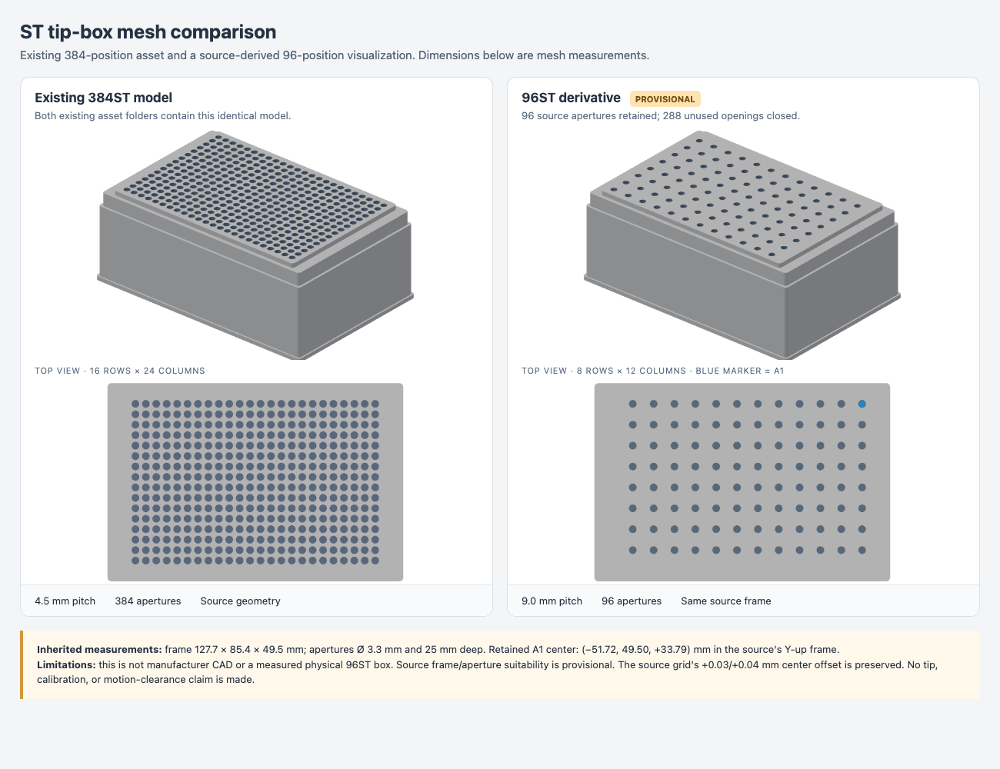
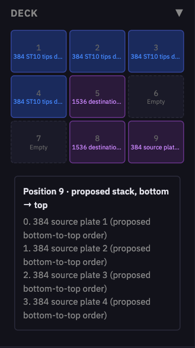

# Protocol Assistant

Protocol Assistant turns written laboratory procedures into reviewed pyBravo
workflows. Open **Protocol Assistant** from the control panel or designer, or
visit `/protocol-assistant`.

The workflow is **source → interpretation → questions → setup → validation →
strict simulation → approval → designer**. The local model proposes structured
data. A deterministic compiler supplies the executable operations. Generated
Python is not accepted in this path.

The [Bravo Capability Manifest](bravo-capability-manifest.md) describes the
configured head's selectable planning operations, catalog-backed tip and
labware choices, geometry patterns, and review requirements in a versioned
machine-readable format. It is discovery information for planning; validation
and approval still govern executable workflows.
The separate [method knowledge layer](bravo-method-knowledge.md) stores
applicability, evidence and technique choices. The manifest carries only its
registry version and lookup pointer, while liquid classes retain the numeric
aspirate, dispense and Z-axis motion settings.
The local model loads focused planning skills from
`pybravo/workflow/protocols/skills/*/SKILL.md` for the relevant procedure, and
the extraction record logs `skills_loaded` and `recipe_hints`. The read-only
`GET /api/protocols/recipes` catalog exposes patterns and their review points;
neither a skill nor a recipe certifies a liquid method.

The setup panel evaluates the manifest's decision rules against the current
draft and only the currently selected source passages, including unsaved
selection changes. It can propose a full-head mode, a tip policy,
source-specific rack order, or disposal when their stated conditions are
supported. Each proposal
shows its evidence and must be accepted into the draft; it is never recorded
as an automatic scientist decision. Liquid class, pipetting height, physical
inventory, and contamination assessment remain open until qualified for the
actual experiment. A missing fact prevents a rule from firing.

The same recommender can suggest free deck positions for materials with known,
non-provisional catalog IDs and exact tip-rack/tip pairing. It reserves all
positions already assigned to materials or named as plate-move destinations.
It also reserves positions that the Bravo's current software deck state shows
as occupied when the draft has not assigned that position. The software state
is advisory and may not match the physical deck. Current tip-box occupancy is
shown as unverified evidence; it never fills in a fresh-tip count or confirms
that a rack is loaded.
It suggests a shared position for source plates only when the draft already
contains one unambiguous, contiguous bottom-to-top stack order; it never
invents that order or tip inventory. Every proposed position still needs
physical placement and clearance confirmation.
When every suggestion fits, **Apply all deck positions** copies those
review-draft positions together; it does not confirm what is physically loaded.

## Start with the local model

Install the optional `llm` dependencies with `pip install -e '.[llm]'`, or run
the launcher with `PYBRAVO_EXTRAS=llm`. Protocol Assistant defaults to
`http://sparky.local:8000/v1`, model alias `qwen`. No cloud key is required and
there is no automatic cloud fallback.

Use `PYBRAVO_DRAFTER_BASE_URL` and `PYBRAVO_DRAFTER_MODEL` to select a different
local compatible endpoint. The server must support chat completions with JSON
schema responses. Configuration is shared with the optional legacy drafter;
setting `PYBRAVO_DRAFTER_PROVIDER=local` explicitly selects local generation
for its endpoints too. See [configuration](configuration.md).

## Build a graph through chat

In the workflow designer, open **Protocol chat** and describe the procedure in
ordinary language. The panel keeps the conversation and asks for missing
scientific details. Each successful message updates the structured plan and
draws its ordered steps as a DAG on a separate designer tab. Follow-up messages
can revise the plan; the original messages remain available as source evidence.

The chat DAG is a structural draft. Its review nodes show operations, citations
and unresolved values; they are not robot tasks. The designer blocks simulation
and execution of this graph. Open its linked Protocol Assistant session to
finish the physical setup, validate and strictly simulate the plan, record
scientist approval, and export the compiled workflow back to the designer.
That export contains the executable nodes and the reviewed deck configuration.

An editable **transfer** is one source-to-destination instruction. Once the
setup validates, the compiler creates separate **Aspirate** and **Dispense**
robot nodes at the stated volume. For the four-source, two-destination draft,
the eight 5 µL transfers become eight 5 µL aspirations and eight 5 µL
dispenses. The compiler does not combine both destinations into one 10 µL
aspiration from each source well.

The chat and setup panel offer **box–tip pairs** for the active head. The box
records physical geometry; the tip definition records capacity, length, and
compatible heads. One box may support several independent tip types, so select
the exact tip loaded in that box for this run. A compatible pair needs an
explicit box-to-tip link and matching head/box geometry. Pairs missing a tip
length are labeled **Planning only**: they can be drafted, but validation and
execution remain blocked until that length is recorded. A full 96ST head can
take an interleaved 96-tip quadrant from a documented 384-position ST rack;
the full 384ST head uses that rack's complete grid. Choosing a chat option
adds its exact box and tip IDs to your message for review before you send it.
Choosing one in setup adds an unplaced tip material, leaving deck slot and
actual tip inventory blank. A model-proposed pair asks for explicit scientist
confirmation of both IDs before validation. A multi-tip box never silently
selects its catalog default.

Imported racks with a plausible recorded format or pitch but incomplete
metadata appear separately as **catalog candidates**. These help identify
which labware record needs work; they are not selectable as verified pairs.
The model may mention a candidate as a lead, but cannot turn its name into a
tip definition or deck assignment. Complete the listed fields in the labware
and tip editors, then reload the active catalog to make a compatible choice
available.

The checked-in catalog currently records these box–tip links:

| Head family | Box | Tip options | Status |
| --- | --- | --- | --- |
| 384ST; 96ST full head via 384-rack quadrant; 16ST where its selected footprint fits | `lw-4914769d0af7` (384 ST, 16×24) | `st_10ul`, `st_70ul` | ST10 has a measured 19.9 mm length; ST70 needs its length before execution. |
| 96LT; 8LT where its selected footprint fits | `lw-b0704e550d2a` (96 LT200, 8×12) | `lt_200ul` | Tip length needs confirmation before execution. |
| 96LT; 8LT where its selected footprint fits | `lw-cadcb0f0f9c1`, `lw-0c182cad7c78` (96 LT250, 8×12) | `lt_250ul` | 55.2 mm length is recorded for the LT head. |

`lw-96st-provisional` is a **visual draft** for a requested 96-position ST box,
not an approved rack. It uses the 96LT grid (8×12, 9 mm pitch) and every other
opening of the checked-in 384ST mesh (about 3.3 mm diameter, 25 mm deep). Its
3D frame measures about 127.7 × 85.4 × 49.5 mm. The catalog footprint
(127.76 × 85.48 mm) and 50 mm thickness are inherited local values, not
measurements of a physical 96ST box. The 2.25 mm X/Y ST teachpoint offsets
come from [Agilent's Bravo guide](https://automation.help.agilent.com/AutomationSolutionsKB14/Bravo%20User%20Guide/SetUp.04.08.html).
Agilent's [consumables guide](https://www.agilent.com/cs/library/brochures/brochure-pipette-and-microplate-5994-5118en-agilent.pdf)
documents ST tips in 384-position racks for 96ST heads; we found no published
specification for a distinct 96-position ST rack. The draft remains marked
provisional, is restricted to the two 96ST head IDs, and has no linked tip
types. Tip selection and pickup stay blocked until the scientist confirms the
physical rack, dimensions and suitable tip types. Compare the model in the
Labware Catalog against the source asset:



The 384 ST box's ST10/ST70 sharing was confirmed by the scientist. The
[Agilent consumables guide](https://www.agilent.com/cs/library/brochures/brochure-pipette-and-microplate-5994-5118en-agilent.pdf)
lists 384-position ST tip racks for both 96ST and 384ST heads, and LT250 rack
`19477-002` for 96LT. The catalog also retains a separate 55.5 mm AssayMAP
teach-tip record for its own workflow; do not substitute it for the 96LT
record. Head/box/tip compatibility in the
catalog does not certify this machine's pickup/ejection calibration or the
liquid class for a particular protocol.

## Four-source 384-to-1536 quadrant draft

For a request to transfer 5 µL from each well of four 384-well source plates
into the same assigned quadrant on **both** initially empty 1536-well plates,
the 384ST-head draft keeps four separate source materials, four separate
384-position ST10 tip boxes, and two destination materials.
The exact example request uses a catalog-backed draft when the active profile
has a 384ST head, gripper, and one verified matching plate and ST10 rack type.
This avoids a long local-model completion for this common layout; the result
still requires the same scientist review and validation as other drafts.

A reviewable nine-position layout is:

| Deck position | Draft assignment |
| --- | --- |
| 1–4 | Four distinct 384 ST10 tip boxes, one per source plate |
| 5 and 8 | Two 1536-well destination plates |
| 6 | Empty working position for the current source plate |
| 7 | Empty position for the processed source-plate stack |
| 9 | Four source plates stacked bottom-to-top |

The Designer shows the proposed seven occupied positions and the source stack
before setup approval. This example is generated from the exact 16-step draft
using a test catalog with matching plate and ST10 rack geometry; the scientist
must confirm the actual catalog items and deck positions.



The [full Designer draft](media/1536-transfer-draft-designer.png) shows the
read-only step graph alongside that deck layout.

The draft processes the stack top-first. Each source is moved to 6, transferred
to one of A1, A2, B1 or B2 on each destination, and moved to 7 before the
next source is accessed. Its 384-tip set is used only for that source's two
transfers, returned to its own emptied box as **spent**, and never selected
again. This is eight full-head 5 µL transfers and 1,536 distinct tips. Each
source well supplies 10 µL total; each destination well receives 5 µL. The
compiled workflow asks the operator to inspect the four fresh racks before
every run and to remove and label the returned tips as spent afterward.
The assistant asks for confirmation of source-to-quadrant and source-to-rack
pairings, the stack order, actual plate IDs and starting/dead volumes, liquid
class, and the 1536-well alignment and teachpoints. The catalog's 1536 Labcyte
entry is a 32×48 grid at 2.25 mm pitch.

[Agilent's replication guide](https://automation.help.agilent.com/AutomationSolutionsKB13/vworks4_ug/08_LiquidHandling.12.15.html)
describes four 384-well sources into 1536-well quadrants and changing the
tip box with each source plate. Its
[384ST tip compatibility table](https://www.agilent.com/cs/library/technicaloverviews/public/te-bravo-automated-liquid-handling-384st-10-ul-tip-5990-3645en-agilent.pdf)
allows ST10 tips with 1536-well plates and excludes ST70. The checked-in
destination catalog lists 5.5 µL per well; 5 µL is close to that limit, so
confirm the exact destination plate and calibrated dispense behavior before
approval. [Beckman's 1536LDV consumables guide](https://media.beckman.com/-/media/pdf-assets/brochures/echo-acoustic-liquid-handler-consumables-brochure.pdf?rev=121d941cb16b47829be390bd8641fe59)
gives a 1–5.5 µL working range for its 1536LDV plates.

## Prepare a protocol

1. Paste a procedure, or upload a PDF. Selectable-text PDFs work locally;
   scanned PDFs require a configured Docling service. Review the extracted
   passages, page references, tables and reading order. Select the procedure
   you intend to automate when a document contains several experiments.
   Pasted input is limited to 200,000 characters; PDFs to 20 MiB, 300 pages
   and 400,000 extracted characters. If Docling fails, selectable-text
   extraction is attempted and the source records a warning.
2. Select the instrument's profile in the control panel. The assistant reads
   its head, calibrated geometry, tip definitions, liquid classes and labware
   catalog. Choose a saved setup or assign the deck explicitly.
3. Extract the plan. Volumes and times retain their source units and citations.
   Unknown values stay blank. Transfers stay transfers even when their plates
   or deck positions have not been chosen. External operations such as
   centrifugation remain manual checkpoints.
4. Review the materials and ordered steps. Supply missing wells, quantities,
   tip strategy, liquid class and deck assignments. Enter starting and dead
   volumes **per well**; use well overrides for uneven starting supplies.
   A transfer's volume is per active channel. The run sheet reports total
   reagent consumption across those channels.
5. Record a reason when changing a source value or supplying an experimental
   decision. Source evidence retains the original quantity: a two-minute wait
   has `2 min` evidence and a normalized duration of 120 seconds. The software
   checks numerical agreement, while the scientist checks that the cited
   passage refers to the intended operation and that the experiment is complete.

Material rows describe physical containers, not a separate deck position for
each reagent name. The current compiler supports disposable pipetting heads,
transfers, mixing, elapsed-time waits, manual checkpoints, gripper plate moves,
and bounded nested repeats. Head footprints must be physically reachable.
Unsupported operations must remain explicit manual handoffs.

Tip supply racks and disposal containers are separate materials. A supply can
be marked **inspected full** or list exactly which fresh tips remain. An
unconfirmed rack blocks compilation. An empty tip box used for disposal
must be marked explicitly empty. Reusing tips requires a written justification.
Manual handoffs eject tips before pausing; return any manually handled labware
to its declared location before confirming completion.

## Validate, simulate and approve

**Validate** checks source identifiers and numeric evidence, missing answers,
deck occupancy, head footprints, tip availability and capacity, liquid-class
compatibility, per-well source/dead volumes, destination capacities and bounded
operation counts. Errors remain visible alongside the editable plan.

**Strict simulation** compiles the accepted plan and runs the actual task logic
against a fresh simulation controller using the reviewed profile and catalog.
Hardware accessories are disabled. Every task error fails the result. Manual
steps are logged as simulated checkpoints and elapsed waits are skipped, so a
passing result does not prove that a physical handoff was completed or that a
timed experiment is biologically valid.
Strict simulation has a 180-second execution timeout; a timed-out run fails
and must be run again after its cause is resolved.

This differs from the designer's visual **Simulate** preview, which is intended
for animation and can continue after task warnings. The assistant requires its
own successful strict result before approval.

Review the run sheet, deck diagram, method differences and manual
interventions. Record the scientist's name and choose a **supervised
qualification run**, a previously qualified procedure with its reference in
the notes, or **scientist-reviewed adaptation after strict simulation** with
the rationale in the notes. If validation reports `method_mismatch`, approval
also requires explicit acceptance of those listed differences. An adapted
method remains labeled as an adaptation; simulation and review do not convert
it into a qualified method or attest that hardware qualification occurred.

Approval binds the source, selected passages, plan, setup, profile, catalogs,
tip-offset calibration and compiled workflow. Changing any of these invalidates
the corresponding result. Export opens the approved workflow in the designer.
Canvas arrangement and saving preserve its executable meaning. Editing steps
requires a new reviewed release. The execution endpoint checks the release
**before initialization or motion** and requires an empty pipetting head.
It checks approval again after initialization and rejects an instrument change
during startup. Only one designer workflow can start or run at a time; an abort
retains that ownership until the workflow has finished stopping.

Physical execution remains an explicit action in the designer. A manual
checkpoint requires the operator to type `completed`; it cannot be ignored.
Read [safety](safety.md) and use the instrument's emergency stop when necessary.

## Reuse and traceability

Save a setup to reuse head selections, tip strategy and deck material
assignments. Publish an approved procedure to the protocol library. Reusing a
library entry creates a new session, retains its source and decisions, and
requires validation, simulation and approval for the new run.

Sessions retain their revision history, original extracted plan, scientist
corrections, local-model settings and completion metadata, source passages,
uploaded source PDF, simulation events, approval and execution outcomes.
The browser remembers the last session and its URL contains a resumable session
identifier. Records live under `~/.pybravo/protocols` unless
`PYBRAVO_PROTOCOL_STORE` selects another directory. Back up this directory
together with the ordinary workflow directory.

These are local provenance records, not authenticated electronic signatures.
The surrounding pyBravo service has the same access assumptions as its existing
control API. Restrict access to the laboratory's trusted control network.

## Catalog readiness and limits

Real labware must have measured geometry, well capacity, an appropriate kind
and a compatible tip definition. The bundled snapshot contains incomplete tip
entries; their names alone do not establish pitch, height or usable capacity.
Correct these through the labware/tip editors and configure the machine's
liquid classes before attempting a liquid workflow. Missing data blocks release.
Never copy the synthetic benchmark's dimensions into a real instrument setup.

Simulation checks the software model; it cannot verify physical deck placement,
calibration accuracy, liquid properties, contamination tolerance or scientific
equivalence. A scientist may release a reviewed adaptation under the explicit
approval basis above, while a `qualified` method requires local qualification
evidence for its stated applicability.

## Evaluate changes

The [synthetic benchmark](../examples/protocols/README.md) includes 18 cases
covering transfers, dilution, mixing, repeats, manual handoffs, unit conversion
and deliberately invalid or underspecified plans. Run:

```sh
python -m pybravo.workflow.protocols.evaluate
python -m pybravo.workflow.protocols.evaluate --extract --limit 4 --output /tmp/protocol-evaluation.json
```

The second command additionally measures the configured local model. Replace or
extend these examples with 10–20 scientist-reviewed laboratory protocols before
assessing laboratory productivity. Track parameter fidelity, omitted steps,
questions, strict-simulation success and actual review time. Stored corrections
provide examples for later prompt improvements; no automatic fine-tuning occurs.

## API

All routes below use the `/api/protocols` prefix. Drafting, validation and strict
simulation never execute physical hardware.

| Method and suffix | Result |
|---|---|
| `GET /context` | Active machine and authoritative catalogs |
| `GET /capabilities` | Published Bravo Capability Manifest and method-registry pointer |
| `GET /methods`, `POST /methods/lookup` | Versioned method registry and read-only applicability lookup |
| `POST /liquid-class-proposals` | Read-only, cross-profile liquid-class planning candidates when simulation lacks an active class; includes original settings and provenance without making them executable |
| `POST /methods` | Save a complete scientist-reviewed method version against expected registry and method revisions |
| `GET /recipes` | Read-only recipe patterns and review points |
| `POST /chat` | Add a scientist message and return a cited draft graph |
| `POST /from-text` | New session from `{text, name}` |
| `POST /ingest` | New session from multipart PDF `file` |
| `GET` at the base path | Session summaries (`GET /api/protocols`) |
| `GET /{id}` | Session and current simulation status |
| `GET /{id}/chat-preview` | Resume the conversation and its draft graph |
| `GET /{id}/source-pdf` | Stored original PDF, when present |
| `PATCH /{id}` | Edit `plan`, `setup`, selected passages with expected `revision` |
| `POST /{id}/extract` | Local-model extraction with bounded repair |
| `POST /{id}/validate` | Deterministic checks and run sheet |
| `POST /{id}/simulate` | Start strict simulation; poll `GET /{id}` |
| `POST /{id}/approve` | Record review, qualification intent and approval |
| `POST /{id}/export-workflow` | Release to designer; return workflow ID and URL |
| `POST /{id}/publish` | Publish an approved named library entry |
| `GET /library` | Approved library entries |
| `POST /library/{id}/reuse` | New unapproved session from an entry |
| `GET /setups`, `POST /setups` | List/save reusable experiment setups |

HTTP 409 indicates a stale revision, unresolved checks, or missing approval.
HTTP 422 indicates invalid input or a model response that could not be repaired.
The interactive `/docs` page contains request schemas.
